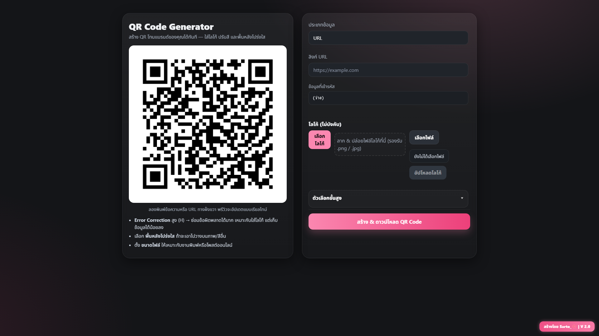

# 🌸 QR Code Generator — by Sarto_

เว็บแอปสำหรับสร้าง **QR Code** ที่ใช้งานง่าย สวย และฟรี  
รองรับโลโก้ สีแบรนด์ พื้นหลังโปร่งใส ไฟล์ PNG/SVG และพรีวิวแบบเรียลไทม์

🔗 **Demo**: [กดที่นี่](https://web-qr-code-generator-main-production.up.railway.app/)


---

## ✨ ฟีเจอร์หลัก

- **สร้าง/พรีวิว QR แบบเรียลไทม์** (PNG) — สีเดียว, ไล่สี Linear/Radial, พื้นหลังโปร่งใส, ใส่โลโก้กลาง
- **ชนิดเอาต์พุต**: PNG (รองรับโปร่งใส/โลโก้/ไล่สี), SVG (เวคเตอร์; โหมดสีเดียว)
- **Error Correction**: L/M/Q/H (ค่าเริ่มต้น H)
- **ขนาดไฟล์**: 256 / 512 / 1024 / 2048 px
- **Data Builder ครอบคลุม**: URL, ข้อความ, Wi-Fi, Email, SMS, ลิงก์ PDF/MP3/รูปภาพ + รองรับอัปโหลดไฟล์จริง
- **จัดการโลโก้**: แกลเลอรี + Drag & Drop + อัปโหลด/ลบ
- **ย่อ URL (Short link)** ของไฟล์ที่อัปโหลดได้ (ป้องกันสร้างซ้ำ)
- **แอดมินแดชบอร์ด**:
  - **การ์ดสรุป**: ผู้เยี่ยมชม (unique), เข้าชมทั้งหมด, ดาวน์โหลด, อัปโหลด
  - **กราฟรายวัน** และ **ตารางรายวัน**
  - **ตัวกรอง ช่วงเวลา**: 7/14/30/60 วัน + เลือกปี + เลือกเดือน
  - **ดาวน์โหลด CSV**
- **วิเคราะห์สถิติ (analytics)**:
  - **บันทึก visit** (unique + visit), **download**, **upload**
  - ตั้งค่า **เขตเวลา (TZ)** เพื่อให้วันที่/กราฟตรงท้องถิ่น

---

## 🧰 เทคโนโลยี

- **Backend**: Python + Flask, Pillow, qrcode, sqlite3
- **Frontend**: Bootstrap 5, Vanilla JS, **Coloris** (ตัวเลือกสี)  
- **DB**: SQLite (ไฟล์ `.db`)

---

## 🚀 เริ่มต้นใช้งาน (Local)

```bash
# 1) โคลนโปรเจกต์
git clone https://github.com/yourname/qr-code-generator.git
cd qr-code-generator

# 2) สร้าง venv และติดตั้ง dependencies
python -m venv .venv
# Windows
.venv\Scripts\activate
# macOS/Linux
source .venv/bin/activate

pip install -r requirements.txt
pip install tzdata

$env:ADMIN_KEY="ADMIN_KEY"

# 3) รัน
python app.py
# เปิด http://127.0.0.1:5000
```
>หากต้องการโหมดพัฒนาให้ตั้ง `FLASK_ENV=development` หรือเปิด `debug=True` ใน `app.py`
---

## ⚙️ การตั้งค่า (สำคัญ)

ค่าเริ่มต้นกำหนดไว้ใน `app.py` (ปรับตามต้องการ):
- `UPLOAD_FOLDER = "static/logo"` – โฟลเดอร์เก็บโลโก้
- `ALLOWED_EXTENSIONS = {"png", "jpg", "jpeg"}`
- `MAX_CONTENT_LENGTH` – จำกัดขนาดไฟล์อัปโหลด (เช่น 2 * 1024 * 1024 = 2 MB)
- **SVG**: ตอนนี้รองรับเฉพาะ **สีเดียว** และ **ไม่รองรับโลโก้ เพื่อความคมและเบาไฟล์**

---

## 🔌 API/Routes
| Method | Path                       | อธิบายย่อ                                  |
| -----: | -------------------------- | ------------------------------------------ |
|    GET | `/`                        | หน้า UI ผู้ใช้ทั่วไป (สร้าง/พรีวิว QR)     |
|   POST | `/preview_qr`              | เรนเดอร์พรีวิว PNG                         |
|   POST | `/upload_logo`             | อัปโหลดโลโก้                               |
|    DEL | `/delete_logo/<name>`      | ลบโลโก้                                    |
|   POST | `/upload_asset/<kind>`     | อัปโหลดไฟล์ **pdf/mp3/image**              |
|    GET | `/s/<code>`                | Redirect ลิงก์สั้น                         |
|    GET | `/admin`                   | หน้าไฟล์/แดชบอร์ด (ต้องล็อกอินแอดมิน)      |
|   POST | `/admin/shorten/<item_id>` | ทำลิงก์สั้นสำหรับไฟล์ (ป้องกันสร้างซ้ำ)    |
|   POST | `/admin/delete`            | ลบไฟล์                                     |
|    GET | `/admin/dashboard`         | กราฟ/สรุป/ตาราง + ตัวกรองช่วงเวลา/ปี/เดือน |
|    GET | `/admin/dashboard.csv`     | ดาวน์โหลด CSV ตามตัวกรองปัจจุบัน           |

> เส้นทาง exact อาจต่างเล็กน้อยตามเวอร์ชันแอปของคุณ ให้ดูใน app.py ของโปรเจกต์คุณเป็นหลัก

---

## 🧪 เคล็ดลับคุณภาพสแกน

- หากมีโลโก้หรือสีอ่อน แนะนำ **Error Correction = H**
- ใช้ขนาดเอาต์พุต **≥ 512 px** สำหรับโซเชียล / **≥ 1024 px** สำหรับพิมพ์
- โลโก้ควรมีด้านยาว ≈ **25% ของด้านกว้าง QR**(แอปจะแนะนำค่าให้อัตโนมัติ)
- ระวังตัด **Quiet Zone** รอบ QR (เว้นขอบอย่างน้อย 4 โมดูล)

---

## 🛡️ ความปลอดภัย

- ตรวจชนิดไฟล์ทั้ง **นามสกุลและ MIME** ก่อนอัปโหลด
- ใช้ `werkzeug.utils.secure_filename` ป้องกัน path traversal
- ควรกำหนด `MAX_CONTENT_LENGTH` ให้เหมาะสม และถ้าขึ้นโปรดักชัน แนะนำ reverse proxy + rate limit

---

## 🧭 ข้อจำกัดปัจจุบัน

- **SVG**: ยังไม่รองรับโลโก้ และยังเป็น สีเดียว (ไม่มีไล่สี)
- หากใส่ข้อมูลยาวมากจนความหนาแน่นสูง ให้ลด **Error Correction**หรือเพิ่ม **ขนาดเอาต์พุต**

---

## 🙌 เครดิต

พัฒนาโดย **Sarto_🌸** — โปรเจกต์เพื่อความสนุกส่วนตัว

ธีมอินเทอร์เฟซออกแบบให้ใช้งานง่ายบนเดสก์ท็อปและมือถือ
